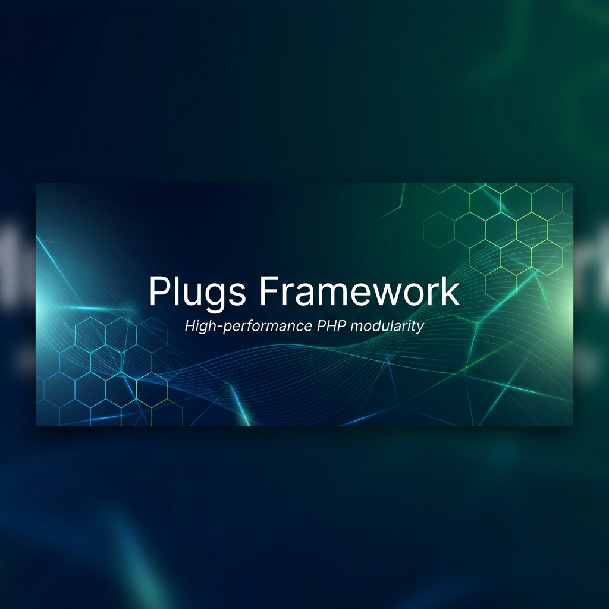

<p align="center">
    
</p>

<p align="center">
    <a href="https://packagist.org/packages/plugs/plugs"></a>
    <a href="https://github.com/celionatti/plugs/blob/main/LICENSE"></a>
    <a href="https://github.com/celionatti/plugs/stargazers"></a>
</p>

---

# Plugs Framework

**Plugs** is a high-performance, modular, and developer-friendly PHP framework designed for modern web applications. It strikes the perfect balance between the structure of a full-stack framework and the freedom of a micro-framework.

> [!NOTE]
> Plugs is built for speed, security, and developer happiness, featuring built-in support for Inertia-like SPA features and a robust security shield.

## 🚀 Key Features

-   ⚡ **Lightning Fast**: Minimal core overhead for peak performance.
-   🧩 **Modular Architecture**: Use only what you need, plug in additional features as required.
-   🛡️ **Security Shield**: Built-in DDoS protection, bot detection, and rate limiting.
-   🌐 **SPA Ready**: Seamlessly build Single Page Applications with server-side routing.
-   🛠️ **Powerful CLI**: Automate your workflow with `theplugs` command-line tool.
-   🗄️ **Fluent DB & ORM**: Clean Query Builder and ActiveRecord models.

## 📦 Installation

You can install Plugs via Composer:

```bash
composer require plugs/plugs
```

## 🛠️ Quick Start

1.  **Environment Setup**:
    ```bash
    cp .env.example .env
    php theplugs key:generate
    ```

2.  **Serve Your App**:
    ```bash
    php theplugs serve
    ```

3.  **Define a Route**:
    ```php
    // routes/web.php
    $router->get('/', function () {
        return view('welcome');
    });
    ```

## 📖 Documentation

Explore our comprehensive guides to learn more about the Plugs Framework:

-   [**Getting Started**](file:///docs/getting-started/introduction.md)
-   [**Routing**](file:///docs/the-basics/routing.md)
-   [**Views & Components**](file:///docs/the-basics/views.md)
-   [**Database & ORM**](file:///docs/database/getting-started.md)
-   [**Security Shield**](file:///docs/security/security-shield.md)
-   [**Inertia / SPA Mode**](file:///docs/advanced/inertia-spa.md)
-   [**CLI Tool**](file:///docs/advanced/cli-commands.md)

## 🤝 Contributing

We welcome contributions from the community! Please review our [Contributing Guide](CONTRIBUTING.md) to get started.

## 📄 License

The Plugs Framework is open-sourced software licensed under the [Apache-2.0 license](LICENSE).

---

<p align="center">
    Built with ❤️ by <a href="https://github.com/celionatti">Celio Natti</a> and contributors.
</p>
