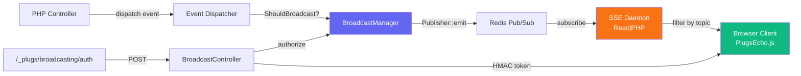

# Broadcasting System

The Plugs Broadcasting system provides a high-level abstraction for pushing real-time events from your PHP backend to connected browser clients. It builds on top of the SSE (Server-Sent Events) transport layer you already know, adding **channel authorization**, **presence tracking**, and **automatic event broadcasting**.

> [!TIP]
> If you've used Laravel Echo before — this is the Plugs equivalent, but built natively on SSE instead of WebSockets. No Pusher, no Socket.io, no external dependencies.

---

## Architecture Overview



**Flow:**
1. Your controller dispatches an event that implements `ShouldBroadcast`
2. The `Dispatcher` detects this and calls `BroadcastManager::broadcast()`
3. The manager publishes to Redis via `Publisher::emit()`
4. The SSE daemon picks it up and pushes to connected clients
5. The JS client (`PlugsEcho`) receives and routes it to your callbacks

---

## Quick Start

### 1. Create a Broadcastable Event

```bash
php theplugs make:event NewChatMessage --broadcast
```

Edit the generated `app/Events/NewChatMessageEvent.php`:

```php
<?php

namespace App\Events;

use Plugs\Event\Event;
use Plugs\Broadcasting\ShouldBroadcast;

class NewChatMessageEvent extends Event implements ShouldBroadcast
{
    public function __construct(
        public readonly int $userId,
        public readonly string $message,
        public readonly string $username,
    ) {}

    public function broadcastOn(): string
    {
        return 'chat';  // Public channel — anyone can listen
    }

    public function broadcastAs(): string
    {
        return 'NewChatMessage';
    }

    public function broadcastWith(): array
    {
        return [
            'user_id'  => $this->userId,
            'username' => $this->username,
            'message'  => $this->message,
        ];
    }
}
```

### 2. Dispatch the Event

```php
// In your controller
use App\Events\NewChatMessageEvent;
use Plugs\Facades\Event;

Event::dispatch(new NewChatMessageEvent(
    userId: $user->id,
    message: $request->input('message'),
    username: $user->username,
));
```

That's it on the PHP side. The event is automatically published to the SSE stream.

### 3. Listen in JavaScript

```html
<script src="/plugs/plugs-echo.js"></script>
<script>
const echo = new PlugsEcho();

echo.channel('chat').listen('NewChatMessage', (data) => {
    console.log(`${data.username}: ${data.message}`);
});
</script>
```

---

## Channel Types

### Public Channels

Anyone can subscribe. No authentication required.

**PHP:**
```php
public function broadcastOn(): string
{
    return 'general-announcements';
}
```

**JavaScript:**
```javascript
echo.channel('general-announcements').listen('Announcement', (data) => {
    showNotification(data.title, data.body);
});
```

### Private Channels

Only authenticated, authorized users can subscribe. The JavaScript client automatically handles the auth handshake via `/_plugs/broadcasting/auth`.

**PHP — Define the channel authorization:**
```php
// In your BroadcastServiceProvider or boot method
use Plugs\Facades\Broadcast;

Broadcast::channel('private-user.{id}', function ($user, $id) {
    return (int) $user->id === (int) $id;
});
```

**PHP — Broadcast on a private channel:**
```php
use Plugs\Broadcasting\PrivateChannel;

public function broadcastOn(): PrivateChannel
{
    return new PrivateChannel('user.' . $this->userId);
    // Results in channel name: 'private-user.42'
}
```

**JavaScript:**
```javascript
echo.private('user.42').listen('BalanceUpdated', (data) => {
    updateBalance(data.new_balance);
});
```

### Presence Channels

Like private channels, but they also track which users are currently online. Perfect for lobbies, chat rooms, and collaborative features.

**PHP — Define the channel authorization:**
```php
Broadcast::channel('presence-game-lobby.{id}', function ($user, $id) {
    // Return user info to share with other members
    return [
        'id'       => $user->id,
        'username' => $user->username,
    ];
});
```

**JavaScript:**
```javascript
echo.join('game-lobby.7')
    .here((members) => {
        // Called once with the initial member list
        console.log('Currently online:', members);
    })
    .joining((member) => {
        // Called when someone joins
        console.log(`${member.username} joined!`);
    })
    .leaving((member) => {
        // Called when someone disconnects
        console.log(`${member.username} left.`);
    })
    .listen('GameStarted', (data) => {
        // Regular events work too
        startGame(data);
    });
```

---

## Channel Authorization

### Registering Channel Callbacks

Register your channel authorization logic in a service provider:

```php
<?php

namespace App\Providers;

use Plugs\Facades\Broadcast;
use Plugs\Support\ServiceProvider;

class BroadcastServiceProvider extends ServiceProvider
{
    public function boot(): void
    {
        // Private: only the user themselves can listen
        Broadcast::channel('private-user.{id}', function ($user, $id) {
            return (int) $user->id === (int) $id;
        });

        // Private: only admins
        Broadcast::channel('private-admin.{section}', function ($user, $section) {
            return $user->role === 'admin';
        });

        // Presence: game lobby — return user info for member tracking
        Broadcast::channel('presence-game.{gameId}', function ($user, $gameId) {
            // Return false to deny, or an array of user info
            return [
                'id'       => $user->id,
                'username' => $user->username,
            ];
        });
    }
}
```

### Auth Route

> [!TIP]
> The auth route is **auto-registered** by the framework at `/_plugs/broadcasting/auth`. No manual route setup needed.

### How Auth Works

1. Client calls `echo.private('user.42')` in JavaScript
2. `PlugsEcho` sends `POST /_plugs/broadcasting/auth` with `{ channel_name: 'private-user.42' }`
3. `BroadcastController` authenticates the user via your guard (session/JWT)
4. It runs the registered channel callback to verify authorization
5. If authorized, it returns an HMAC-signed token with a 1-hour TTL
6. The JS client passes this token as a query parameter when connecting to the SSE daemon
7. The SSE daemon verifies the token before allowing the subscription

---

## Model Broadcasting

Automatically broadcast model lifecycle events (created, updated, deleted) without writing any event classes.

### Setup

```php
<?php

namespace App\Models;

use Plugs\Database\Collection;
use Plugs\Broadcasting\BroadcastsEvents;

class Game extends Collection
{
    use BroadcastsEvents;

    protected string $table = 'games';
    // ...
}
```

Now whenever a `Game` is created, updated, or deleted, the change is automatically broadcast:

- **Channel:** `private-game.{id}` (default, customizable)
- **Events:** `GameCreated`, `GameUpdated`, `GameDeleted`
- **Payload:** The model's array representation

### Customization

```php
class Game extends Collection
{
    use BroadcastsEvents;

    // Custom channel name
    public function broadcastChannel(): string
    {
        return 'game-updates'; // Public channel instead of private
    }

    // Custom payload per event type
    public function broadcastWith(string $event): array
    {
        if ($event === 'deleted') {
            return ['id' => $this->id];
        }

        return [
            'id'     => $this->id,
            'name'   => $this->name,
            'status' => $this->status,
        ];
    }

    // Only broadcast specific events
    public function shouldBroadcastEvent(string $event): bool
    {
        // Don't broadcast deletions
        return $event !== 'deleted';
    }
}
```

### Listening for Model Events

```javascript
echo.private('game.42').listen('GameUpdated', (data) => {
    console.log('Game updated:', data);
});
```

---

## JavaScript Client API

### Initialization

```javascript
const echo = new PlugsEcho({
    host: 'https://your-domain.com',       // Default: window.location.origin
    authEndpoint: '/_plugs/broadcasting/auth', // Default (auto-registered)
    authHeaders: {                           // Optional extra headers
        'Authorization': 'Bearer ' + token,
    },
    csrfToken: 'your-csrf-token',          // Auto-detected from <meta> tag
});
```

### Public Channels

```javascript
const channel = echo.channel('news');

channel.listen('BreakingNews', (data) => { ... });
channel.listen('WeatherUpdate', (data) => { ... });
channel.stopListening('WeatherUpdate');
```

### Private Channels

```javascript
const userChannel = echo.private('user.42');

userChannel.listen('NotificationReceived', (data) => { ... });
userChannel.listen('BalanceUpdated', (data) => { ... });
```

### Presence Channels

```javascript
const lobby = echo.join('game-lobby.7');

lobby
    .here((members) => { renderMemberList(members); })
    .joining((user) => { addToMemberList(user); })
    .leaving((user) => { removeFromMemberList(user); })
    .listen('GameStarted', (data) => { navigateToGame(data); });

// Access current members anytime
console.log(lobby.members);
```

### Leaving Channels

```javascript
echo.leave('game-lobby.7');  // Leaves the presence channel
echo.disconnect();           // Disconnects all channels
```

---

## Migration Guide

### From Raw `Publisher::emit()` to `ShouldBroadcast`

**Before (manual publishing):**
```php
use Plugs\SSE\Publisher;

// In your controller
Publisher::emit('chat', [
    'user' => $user->username,
    'message' => $message,
]);
```

**After (automatic broadcasting):**
```php
use App\Events\NewChatMessageEvent;

// In your controller — dispatch the event, broadcasting happens automatically
Event::dispatch(new NewChatMessageEvent($user->id, $message, $user->username));
```

> [!NOTE]
> You can still use `Publisher::emit()` directly for simple cases. The `ShouldBroadcast` system is an **addition**, not a replacement.

### From `PlugsSSE` to `PlugsEcho`

**Before:**
```javascript
window.plugsSSE.listen('chat', (data) => { ... });
```

**After:**
```javascript
const echo = new PlugsEcho();
echo.channel('chat').listen('NewChatMessage', (data) => { ... });
```

> [!NOTE]
> The `plugs-sse.js` client still works for public channels. `PlugsEcho` adds auth and presence on top.

---

## SSE Daemon

The SSE daemon (`php theplugs sse:start`) has been upgraded with broadcasting support:

```
SSE Broadcast Daemon v2.0
  → Public channels: no auth required
  → Private channels (private-*): token auth enforced
  → Presence channels (presence-*): token auth + member tracking
```

### Connection URLs

| Channel Type | URL Format |
|---|---|
| Public | `GET /api/stream?topics=chat` |
| Private | `GET /api/stream?topics=private-user.42&token=abc123` |
| Presence | `GET /api/stream?topics=presence-lobby.1&token=abc123&user_info=base64(...)` |

### Presence Members API

```
GET /api/stream/members?channel=presence-game-lobby.7
```

Response:
```json
{
    "channel": "presence-game-lobby.7",
    "members": [
        { "id": 1, "username": "Player1" },
        { "id": 2, "username": "Player2" }
    ],
    "count": 2
}
```

---

## CLI Commands

```bash
# Generate a standard event
php theplugs make:event OrderPlaced

# Generate a broadcastable event (implements ShouldBroadcast)
php theplugs make:event OrderPlaced --broadcast

# Start the SSE daemon with broadcasting support
php theplugs sse:start --port=8080
```

---

## Security Considerations

> [!WARNING]
> **Never expose sensitive data on public channels.** Any user can subscribe to public channels without authentication. Use private channels for user-specific or sensitive data.

- **Token-based auth**: Private/presence channels use HMAC SHA-256 signed tokens tied to the `APP_KEY`
- **Token TTL**: Tokens expire after 1 hour. The JS client automatically re-authenticates
- **Channel patterns**: Authorization callbacks use parameterized patterns (`private-user.{id}`) for flexible access control
- **Redis isolation**: Presence state is stored in Redis with a 24h safety TTL

---

## Comparison with Laravel Echo

| Feature | Laravel Echo | Plugs Broadcasting |
|---|---|---|
| Public Channels | ✅ | ✅ |
| Private Channels | ✅ | ✅ |
| Presence Channels | ✅ | ✅ |
| ShouldBroadcast | ✅ | ✅ |
| Model Broadcasting | ✅ | ✅ |
| Channel Authorization | ✅ | ✅ |
| Whisper (Client Events) | ✅ | ❌ (SSE is one-way) |
| WebSocket Transport | ✅ | ❌ (SSE only) |
| No External Dependencies | ❌ (Pusher/Soketi) | ✅ |
| Works without JS build tools | ❌ | ✅ |
